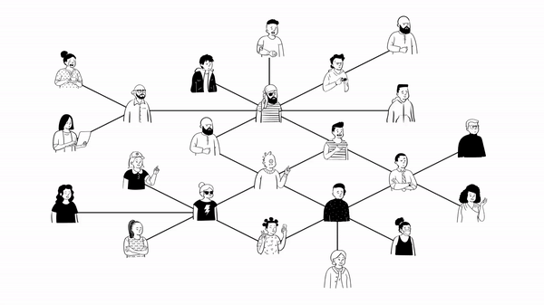
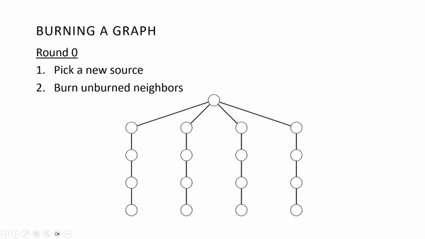

# DAG Generator
This program serves two purposes:
1. Generate different orientations of directed acyclic graphs (DAGs) for the purpose of research on graph burning, a subfield of graph theory.
2. Run the graph burning process for imported graph files and determine burning number statistics about those graphs.



## Background
Graph burning is a two-step, round-based process that models how quickly an influence or contagion can spread over a given graph. The goal of this process is to determine a parameter called the burning number, defined as the minimum number of rounds needed for an influence to spread over an entire graph. This parameter has recently been researched across various graph families. 



In our research, we introduced the burning number in directed graphs, or digraphs. As part of the research process, I developed this program to not only generate graph data with which to experiment with, but also to be able to run the graph burning process over these generated graphs and be able to easily determine the burning number for large sets of digraphs.

## How to Use

1. Clone the repository:
   ```
   git clone https://github.com/mctripp10/dag-generator.git
   ```
2. Run the program and follow the prompts in the terminal to select a mode and corresponding parameters.

## Project Layout
- `code/` - contains all Java code for this application
   - `BurningGraph.java` - graph object with accompanying method for graph burning
   - `GraphGenerator.java` - graph generator object to generate graph data files
   - `Main.java` - main program to execute both graph burning and graph generation from one place
- `dags/` - contains graphs files generated from method 1 (all orientations of a k-node graph)
- `dags_random/` - contains graph files generated from method 2 (m random DAG orientations with k nodes)
- `graphs/` - contains graph files the user manually created to test specific graphs
- `results.txt` - log of all results from graph burning in mode 2

## Mode 1: Graph Generation

This mode allows the user to pick between two different methods of generating graphs. Note that all graphs directed and acyclic by default, although there is a setting within the program to toggle a graph to undirected. Directed acyclic graphs, or DAGs, were the specific group of graphs we wanted to target in our research. 

### Method 1: Generate All Orientations 
More specifically, we wanted to determine how changing a digraph's orientation (edge directions) would affect the burning number. Thus, I designed this program to generate all possible unique orientations of a given k-node digraph, allowing us to make observations over the entire set of orientations for k-node digraphs. To do so, select #2 as your method of generation. This method can quickly become unreliable, however, with larger node digraphs, as generating _all_ possible orientations for large graphs becomes very computationally expensive.

### Method 2: Generate Random Orientations
To address this problem, I implemented a second method of generation that allows the user to define how many orientations they would like to generate from a given k-node DAG. This method randomly generates unique orientations, with the assumption that not all orientations for the given graph will be able to be generated if it is for a large size DAG. As such, this method can be used to generate graph data for large size digraphs without the computational cost of generating all possible orientations, only as many as the user defines.

Both methods will generate a `.txt` file containing the graph data with the properties the user specified.

## Mode 2: Graph Burning 

This mode can be used to output burning number statistics for a given set of DAG orientations, including:
- Burning number for each orientation
- Burning sequence for each orientation
- Average/min/max burning number across all orientations

To import a graph file, simply enter the path to the `.txt` file containing the graph data when prompted.


